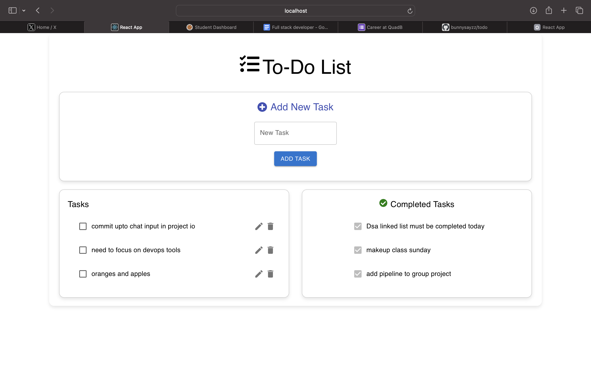

# To-Do List Application

Deployed Link: https://todo-lovat-alpha.vercel.app




## Overview

This is a simple To-Do List application built with React and Redux. It allows users to add, edit, delete, and toggle tasks as completed. The tasks are persisted in the browser's local storage.

## Features

- Add new tasks
- Edit existing tasks
- Delete tasks
- Mark tasks as completed
- View completed tasks
- Persist tasks in local storage

## Technologies Used

- React
- Redux
- Material-UI
- Local Storage

## Getting Started

### Prerequisites

- Node.js (v12 or higher)
- npm (v6 or higher)

### Installation

1. Clone the repository:
    ```bash
    git clone https://github.com/bunnysayzz/todo.git
    ```
2. Install dependencies:
    ```bash
    cd todo
    npm install
    ```

### Running the Application

1. Start the development server:
    ```bash
    npm start
    ```
2. Open your browser and navigate to `http://localhost:3000`.

### Building the Application

1. Create a production build:
    ```bash
    npm run build
    ```

## Project Structure

- `src/`
  - `components/`: Contains React components like `TaskInput`, `TaskList`, `CompletedTaskList`, and `TaskItem`.
  - `redux/`: Contains Redux setup including actions, reducer, and store.
  - `App.js`: Main application component.
  - `App.css`: Application styles.
